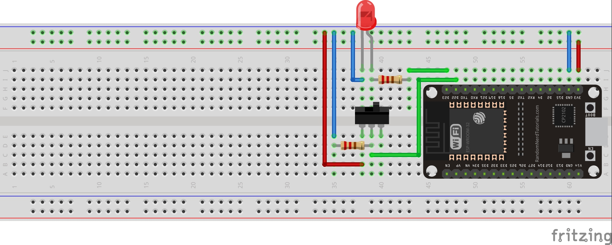

# Led Button PlatformIO simple project

You need the [PlatformIO IDE](http://platformio.org/) installed and ESP32 Dev Kit V1 device to run this project. I used [VS Code](https://platformio.org/install/ide?install=vscode) as my IDE.

